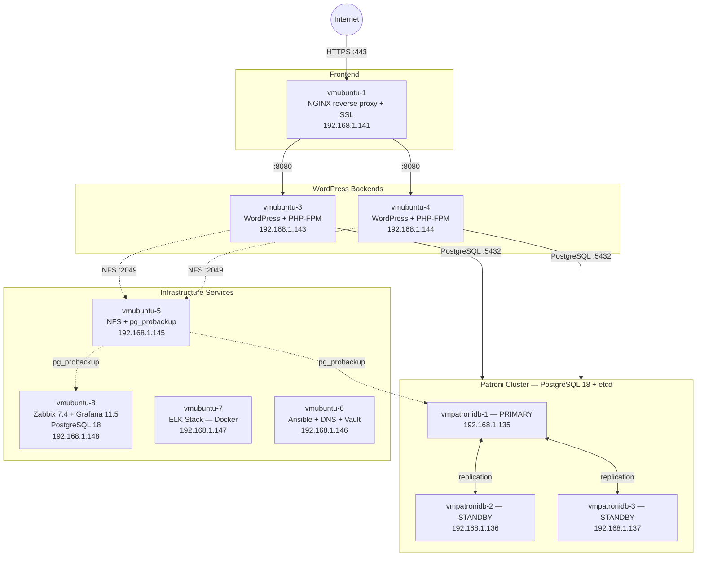

# Patroni Automation

Ansible-проект для автоматического развёртывания отказоустойчивой инфраструктуры на базе **PostgreSQL 18 + Patroni** с веб-приложением WordPress, мониторингом, централизованным логированием и резервным копированием.

Все VM создаются из шаблона в vCenter, конфигурируются через Ansible, секреты хранятся в HashiCorp Vault.

## Стек

- **Database**: PostgreSQL 18 — 3-node Patroni cluster (etcd DCS, streaming replication, auto-failover)
- **Application**: WordPress + PHP-FPM + pg4wp (PostgreSQL-драйвер), 2 backend-сервера за NGINX reverse proxy с SSL
- **Storage**: NFS — общее хранилище uploads для WordPress
- **Monitoring**: Zabbix Server 7.4 + Grafana 11.5 + Zabbix Agent2 на всех узлах
- **Logging**: ELK Stack (Elasticsearch + Logstash + Kibana) + Filebeat на всех узлах
- **Backup**: pg_probackup — инкрементальные бэкапы Patroni-кластера и monitoring DB
- **Secrets**: HashiCorp Vault
- **DNS**: dnsmasq
- **Provisioning**: VMware vCenter + ESXi

## Быстрый старт

```bash
# Полное развёртывание всей инфраструктуры
ansible-playbook playbooks/deploy_all.yml

# Только Patroni-кластер + WordPress + NFS
ansible-playbook playbooks/deploy_patroni_cluster.yml

# Отдельные компоненты
ansible-playbook playbooks/deploy_monitoring.yml
ansible-playbook playbooks/deploy_logging.yml
ansible-playbook playbooks/deploy_backup.yml
```

## Структура проекта

```
├── vars.yml                          # Все переменные (VM, сеть, кластер, Vault-lookup)
├── playbooks/
│   ├── deploy_all.yml                # Полное развёртывание
│   ├── deploy_patroni_cluster.yml    # Patroni + WordPress + NFS + DNS
│   ├── deploy_monitoring.yml         # Zabbix + Grafana + Agent2
│   ├── deploy_logging.yml            # Docker + ELK + Filebeat
│   └── deploy_backup.yml            # pg_probackup
├── roles/
│   ├── vm_provision/                 # Клонирование VM из шаблона vCenter
│   ├── vault_passwords/             # Генерация и сохранение секретов в Vault
│   ├── patroni_packages/            # Установка PostgreSQL, Patroni, etcd
│   ├── etcd_setup/                  # Настройка etcd-кластера
│   ├── patroni_setup/               # Настройка Patroni
│   ├── patroni_db_config/           # Создание БД, пользователей, pg_hba
│   ├── wordpress_backend/           # WordPress + PHP-FPM + pg4wp
│   ├── nginx_frontend/              # NGINX reverse proxy + SSL
│   ├── nfs_server/                  # NFS-сервер для shared uploads
│   ├── monitoring_postgres/         # PostgreSQL для Zabbix/Grafana
│   ├── zabbix_server/               # Zabbix Server + Web UI
│   ├── zabbix_agent2/               # Zabbix Agent2 на всех узлах
│   ├── zabbix_register/             # Регистрация хостов в Zabbix через API
│   ├── grafana/                     # Grafana + дашборды
│   ├── docker/                      # Docker на всех узлах
│   ├── elk_stack/                   # ELK Stack (Docker Compose)
│   ├── filebeat/                    # Filebeat-контейнеры
│   └── pg_probackup/               # Резервное копирование
├── inventories/                      # Inventory-файлы
├── group_vars/                       # Групповые переменные
└── collections/                      # Ansible-коллекции
```

## Архитектура



> **Примечания:**
> - WordPress подключается ко всем 3 узлам Patroni через multi-host строку (`target_session_attrs=read-write`) — автоматический failover на primary
> - Все VM отправляют логи в ELK через Filebeat (Logstash :5044)
> - Все VM мониторятся Zabbix Agent2 (:10050)
> - Ansible (vmubuntu-6) управляет всеми VM по SSH :22
> - etcd-кластер работает на всех 3 узлах Patroni (:2379/:2380)
> - vmubuntu-2 (192.168.1.142) — резервная VM

| VM | IP | Роль |
|----|----|------|
| vmpatronidb-1/2/3 | .135 / .136 / .137 | PostgreSQL 18 + Patroni + etcd |
| vmubuntu-1 | .141 | NGINX frontend (reverse proxy + SSL) |
| vmubuntu-2 | .142 | Резерв |
| vmubuntu-3 | .143 | WordPress backend 1 |
| vmubuntu-4 | .144 | WordPress backend 2 |
| vmubuntu-5 | .145 | NFS server + pg_probackup + PostgreSQL 18 |
| vmubuntu-6 | .146 | Ansible control node + DNS (dnsmasq) + Vault |
| vmubuntu-7 | .147 | ELK Stack (Elasticsearch + Logstash + Kibana) |
| vmubuntu-8 | .148 | Zabbix Server + Grafana + PostgreSQL 18 |

*Все IP в подсети `192.168.1.0/24`. ESXi: `192.168.1.83`, vCenter: `192.168.1.140`.*
